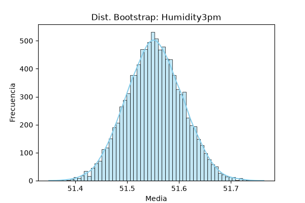
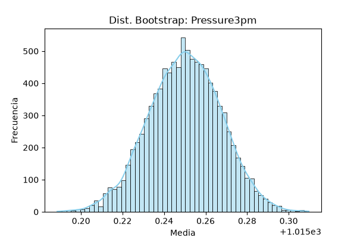
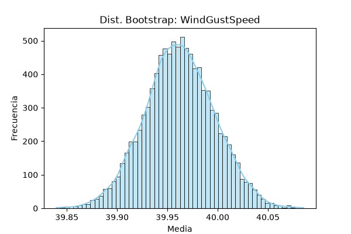

# Reporte S2: Validación y Métodos de Remuestreo

## 1. Análisis e Interpretación de Resultados

Tras la ejecución del remuestreo no paramétrico con 10.000 iteraciones, se presentan los siguientes hallazgos técnicos:

* **Convergencia y Normalidad:** Los histogramas muestran una distribución de medias remuestreadas con una clara forma de campana, consistente con el Teorema del Límite Central.
* **Precisión de las Estimaciones:** La baja variabilidad en los intervalos de confianza (IC 95%) indica que nuestras estimaciones son robustas.
* **Validación de la Sumativa 1:** Existe una alta coherencia entre los métodos, lo que refuerza la confiabilidad de los datos sobre el dataset `weatherAUS`.

### Tabla Comparativa: Validación S1 vs. Bootstrap

| Variable | IC Clásico S1 | IC Bootstrap (Percentil) | IC Bootstrap (BCa) |
| :--- | :---: | :---: | :---: |
| Humidity3pm | 51.45 – 51.66 | 51.45 – 51.66 | 51.45 – 51.66 |
| Pressure3pm | 1015.22 – 1015.28 | 1015.22 – 1015.28 | 1015.22 – 1015.28 |
| WindGustSpeed | 39.89 – 40.03 | 39.90 – 40.03 | 39.89 – 40.03 |

---

## 2. Visualización de Resultados

A continuación, se presentan las distribuciones obtenidas para cada variable:

**Humidity3pm:**

**Pressure3pm:**

**WindGustSpeed:**

---

## 3. Nota Técnica y Conclusión

**Nota Técnica:** Se empleó el método BCa para corregir posibles sesgos. Dado que las distribuciones obtenidas presentan alta simetría, los resultados convergen con el método percentil, validando la robustez del estimador.

**Interpretación Final:** Los resultados obtenidos mediante Bootstrap presentan una consistencia elevada con respecto a la S1. La mínima diferencia observada confirma la estabilidad de nuestros parámetros meteorológicos.